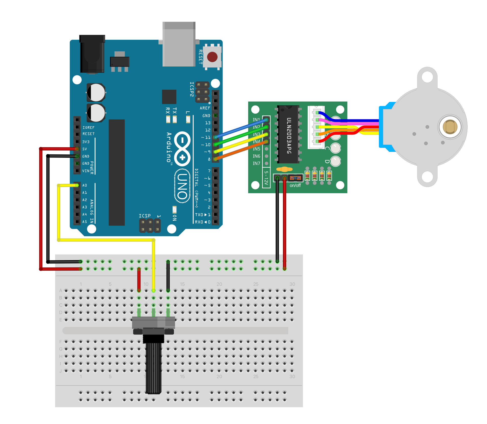

:title: Drawing Tools
:author: Heerko van der Kooij
:description: Introduction for the Hacking tools as artistic research @ Kabk 
:css: tool_hacking.css

.. header::

   Drawing Machines

----

Drawing Machines
================

.. image:: ./assets/images/Tinguely_Drawing_Machine.png

https://github.com/hackersanddesigners/tool_hacking
https://hackersanddesigners.github.io/tool_hacking/build

----

Albrecht Durer
==============

.. image:: ./assets/images/Albrecht_Durer.jpg

----

Jean Tinguely
=============

.. raw:: html

  <video width="100%" controls poster="./assets/images/JeanTinguely-0001.png">
    <source src="./assets/videos/JeanTinguely.mp4" type="video/mp4" >
  </video>

----

Olafur Eliason
==============

.. raw:: html

  <video width="100%" controls poster="./assets/images/OlafurEliasson-0001.png">
    <source src="./assets/videos/OlafurEliasson.mp4" type="video/mp4" >
  </video>

.. note::
  
  Harmonograph

----

Damien Hirst
============

.. raw:: html

  <video width="100%" controls poster="./assets/images/damienhirst.png">
    <source src="./assets/videos/DamienHirst.mp4" type="video/mp4" >
  </video>

.. note::
  I love making spin paintings with kids, I’ve got a spin machine that I take to my kids' school and get all the kids doing them, the joy of making them is what somehow makes them great art and all those crazy moments throwing paint around and mostly not knowing what you’re doing is distilled in the final result and that’s why they’re so amazing; they immortalise a feeling or a collection of feelings, a fleeting, colourful happiness, they are like tracks in time, like footprints in the snow. 
  What does an artwork say about an artist’s personality? Is the person of the artist always present in the piece of art? It’s something I’ve thought of quite often with the spins because they’re an interesting meditation on the role of the artist – the results manage to say not a lot about the person who has spun them, because they’re governed by the forces of chance and movement, and in the end it’s harder to make a bad one than a good one and they all look similar in some way whoever makes them. 

  David called them 'art without the angst'.

  https://www.sothebys.com/en/articles/hirst-on-bowie

----

Damien Hirst
============

.. raw:: html

  <video width="100%" controls >
    <source src="./assets/videos/Damien Hirst x Snapchat in support of Partners in Health _ Spin Art.mp4" type="video/mp4" >
  </video>

----

Tim Lewis
=========

.. raw:: html

  <video width="100%" controls>
    <source src="./assets/videos/TIM LEWIS Machine 20 May - 18 June.mp4" type="video/mp4" >
  </video>

----

Harvey Moon
===========

.. raw:: html

  <video width="100%" controls poster="./assets/images/harveymoon.png">
    <source src="./assets/videos/Robot Art_ Harvey Moon's Drawing Machines.mp4" type="video/mp4" >
  </video>

----

Approaches
==========

.. class:: substep

- Sculptural / Chaotic
- Sculptural / Controlled
- Physical / Pattern based
- Functional / Controlled

----

Servos
======

  
----

.. image:: ./assets/images/Servo_control.png

----
  
Library
=======

**Menu > Sketch > Include Library** 

----

:data-x: r500
:data-y: r0
:data-scale: 0.4

.. image:: ./assets/images/Library.png

----

:data-x: r1600
:data-scale: 1
:class: code-slide

Linear
==============

.. code:: arduino
    
    #include <Servo.h>

    Servo myservo;
    int pos = 0;
    int step = 1;

    void setup() {
      myservo.attach(9); // attaches the servo on pin 9 to the servo object
    }

    void loop() {
      myservo.write(pos); // tell servo to go to position in variable 'pos'
      pos = pos + step;
      if( pos >= 180 || pos <= 0 ) {
        step = -step;
      }
      delay(15);
    }

----

:class: code-slide

Sinusoidal
==================

.. code:: arduino

  #include <Servo.h>

  Servo myservo;
  int pos = 0;
  float count = 0;
  float step = 0.01;

  void setup() {
    myservo.attach(9);
  }

  void loop() {
    pos = sin(step) * 90 + 90;
    myservo.write(pos);
    step += 0.1;
    delay(50);
  }

----

:class: code-slide

Random
==================

.. code:: arduino

  #include <Servo.h>

  Servo myservo;
  int pos = 0;
  int step = 1;
  int from = 0;
  int to = 180;

  void setup() {
    myservo.attach(9);
  }

  void loop() {
    myservo.write(pos);
    pos = pos + step;
    if( pos >= to ) {
      step = -step;
      from = random(0,90);
    } else if(pos <= from ) {
      step = -step;
      to = random(90, 180);
    }
    delay(15);
  }

----

.. image:: ./assets/images/drawing_machine_1.jpg
  :width: 600

----

:data-x: r620
:data-y: r-300

.. image:: ./assets/images/drawing_machine_2.jpg
  :width: 600

----

:data-x: r0
:data-y: 260

.. image:: ./assets/images/drawing_machine_3.png 
  :width: 600

----

:data-x: r1600
:data-y: r0

Steppers
========

.. raw:: html

  <video width="100%" autoplay loop style="float:left; width: 300px">
    <source src="./assets/videos/stepper.mp4" type="video/mp4" >
  </video>
  
----

.. image:: ./assets/images/stepper_uln2003a.png

----

:class: code-slide

Back & Forth
============

.. code:: arduino

    #include <Stepper.h>
    const int stepsPerRevolution = 2048;

    // Connect Arduino to ULN2003 like so:
    // Pin 8 -> IN1, Pin 9 -> IN2, Pin 10 -> IN3, Pin 11 -> IN4
    Stepper myStepper = Stepper(stepsPerRevolution, 8, 10, 9, 11);

    void setup() {
      myStepper.setSpeed(5); // maximum = 15!
    }

    void loop() {
      // Step one revolution in one direction:
      myStepper.step(stepsPerRevolution);
      delay(500);
      // Step one revolution in the other direction:
      myStepper.step(-stepsPerRevolution);
      delay(500);
    }

----

:class: code-slide

Potentiometer
=============

.. code:: arduino

  #include <Stepper.h>

  const int stepsPerRevolution = 2048;
  // Arduino -> ULN2003
  // Pin 8 -> IN1, Pin 9 -> IN2, Pin 10 -> IN3, Pin 11 -> IN4
  Stepper myStepper = Stepper(stepsPerRevolution, 8, 10, 9, 11);

  void setup() {
    myStepper.setSpeed(5); // maximum = 15!
  }
  void loop() {
    int potValue = analogRead(A0);
    // map analog values (0-1023) to stepper speed (1-15)
    int spd = map(potValue, 0, 1023, 1, 15); 
    myStepper.setSpeed(spd);
    myStepper.step(10);
  }

----

:data-x: r0
:data-y: r600

----

:data-x: r800
:data-y: r-600
:data-scale: 0.1

.. image:: ./assets/images/machine1.jpg

----

:data-x: r160
:data-y: r100

----

:data-x: r-160
:data-y: r100

----

:data-x: r160
:data-y: r100

.. image:: ./assets/images/machine4.jpg

----

:data-x: r-160
:data-y: r100

.. image:: ./assets/images/machine5.jpg

----

:data-x: r-160
:data-y: r100

.. image:: ./assets/images/machine6.jpg

