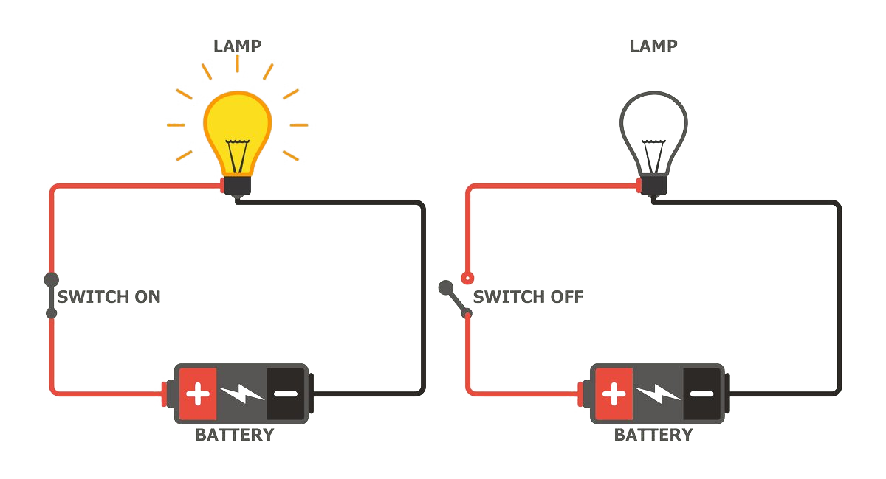
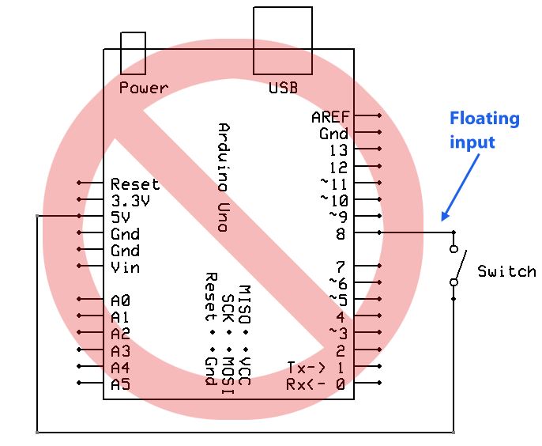

:title: Tools & Controllers
:author: Heerko van der Kooij
:description: Introduction for the Hacking tools as artistic research @ Kabk 
:css: tool_hacking.css

.. header::

   Hacking Tools

----

  :id: arduino

Hacking Tools
======================

.. image:: images/Arduino.png

https://github.com/hackersanddesigners/tool_hacking
https://hackersanddesigners.github.io/tool_hacking/build/

----

:data-x: r140
:data-y: r116
:data-scale: 0.075

.. image:: ./images/Atmega328_die.jpg

----

:data-x: r1800
:data-y: r0
:data-scale: 1

Arduino is...
=============

* An open-source/-hardware microcontroller device 
* Designed to sense
* Designed to control 
* Easy to program
* Easy to integrate into designs 
* Developed by art-technologists to be practical for simple and complex designs with minimal hassle 

----

.. image:: images/Arduino_models.png

----

:data-scale: 1.4

.. image:: images/input_output.png 

----

:data-x: r100
:data-y: r-250
:data-scale: 0.1

Input (Sensors)
===============
* Push Buttons (digital)
* Potentiometer - turning knob
* LDR - light dependant resistor
* Flex sensors - senses bending
* PIR - senses presence, alarm system
* accelerometer - senses changes in speed

----

:data-x: r-100
:data-y: r200
:data-scale: 1

----

:data-x: r100
:data-y: r250
:data-scale: 0.1

Output (Actuators)
==================
* Leds & lights
* Speaker (beeper)
* DC motors
* Stepper motors
* Servos
* Solenoids
* Anything electronic: Transisors / Relays / 

----

:data-x: r-100
:data-y: r-200
:data-scale: 1

---- 

:data-x: r1600
:data-y: r0
:data-scale: 1

Some Terms
==========
* ‘**sketch**’ – program that runs on the Arduino
* ‘**pin**’ – input or output connected to something, like a LED or a switch
* ‘**digital**’ – 1 (HIGH) or 0 (LOW) value (on/off)
* ‘**analog**’ – a range of voltages between 0 and 5 volts, instead of discrete on and off.

----

:data-x: r1600
:data-y: r0

Setting up the software
=======================

https://www.arduino.cc/en/software

Download the IDE for your platform

----

Hello World
===========

.. code:: arduino

  int led = 13;

  void setup() {
    pinMode(led, OUTPUT);
  }

  void loop() {
    digitalWrite(led, HIGH);
    delay(1000);
    digitalWrite(led, LOW);
    delay(1000);
  }

----

:data-scale: 0.5
:data-x: r500
:data-y: r-250

Verify
======

----

:data-x: r0
:data-y: r250

Errors?
=======

.. image:: ./images/Errors.png

----

Upload
======

.. image:: ./images/Compile.png

----

:data-scale: 1
:data-x: r1600
:data-y: r-250
:class: full-width-image

WOOHOO!
=======

.. raw:: html

  <video width="100%"  autoplay loop>
    <source src="./images/blink.mp4" type="video/mp4" >
  </video>

----
    
:data-y: r0
:class: large-text

* Setup:
    * Turn pin 13 into an output
* Loop:
    * Turn on led
    * Wait for a second
    * Turn off led
    * Wait for a second
    * Start the loop over
    * and over, and over, and over…

----

circuit
=======

----

Buttons, Pull-up & Pull-down
===============================

----

:data-x: r700

----

:data-x: r1600

pinMode INPUT_PULLUP
===============================

.. image:: ./images/ArduinoUno_Button_InternalPullUpResistor_WiringDiagram.png

.. code:: arduino
    
    pinMode(2, INPUT_PULLUP);

----

Examples Arduino
================

File > Examples > USB

----

:data-x: r1600

Keyboard
========

.. code:: arduino

    #include <Keyboard.h>
    int buttonPin = 3;

    void setup() { 
        pinMode( buttonPin, INPUT_PULLUP ); // connect the button to pin 3
        Keyboard.begin(); // start the keyboard library
        delay(3000); // upload delay
    }

    void loop() {
        int pressed = digitalRead( buttonPin );  // read pin 3
        if( pressed == HIGH ){ // if the button is pressed
            Keyboard.write( 'd' ); // print the letter d
            delay( 100 ); // do nothing for 0.1 second
        }
    }

----

Fail safe
=========

.. code:: arduino

    void setup() { 
        // ... other code
        delay(3000); // wait a few seconds before starting the main program 
    }

----

Logging out
===========

...code

.. code:: arduino

    Keyboard.press(KEY_LEFT_GUI);
    // Shift-Q logs out:
    Keyboard.press(KEY_LEFT_SHIFT);
    Keyboard.press('Q');
    delay(100);
    Keyboard.releaseAll();
    // enter:
    Keyboard.write(KEY_RETURN);

code...

----

Keyboard
========

Single key: 

* Keyboard.write() 

Text: 

* Keyboard.print()
* Keyboard.println()

Modifier keys:

* Keyboard.press()
* Keyboard.release()
* Keyboard.releaseAll()

----

:class: columns columns-3 no-list

Keyboard
========

* KEY_LEFT_CTRL
* KEY_LEFT_SHIFT
* KEY_LEFT_ALT
* KEY_LEFT_GUI
* KEY_RIGHT_CTRL
* KEY_RIGHT_SHIF
* KEY_RIGHT_ALT
* KEY_RIGHT_GUI
* KEY_UP_ARROW
* KEY_DOWN_ARROW
* KEY_LEFT_ARROW
* KEY_RIGHT_ARROW
* KEY_BACKSPACE
* KEY_TAB
* KEY_RETURN
* KEY_ESC
* KEY_INSERT
* KEY_DELETE
* KEY_PAGE_UP
* KEY_PAGE_DOWN
* KEY_HOME
* KEY_END
* KEY_CAPS_LOCK
* KEY_F1
* KEY_F2
* KEY_F3
* KEY_F4
* KEY_F5
* KEY_F6
* KEY_F7
* KEY_F8
* KEY_F9
* KEY_F10
* KEY_F11
* KEY_F12

----

Mouse
=====

.. code:: arduino

    #include <Mouse.h>

    int buttonPin = 9;  // Set a button to any pin

    void setup()
    {
      pinMode(buttonPin, INPUT_PULLUP);  // Set the button as an input
      Mouse.begin(); // start the mouse library
    }

    void loop()
    {
      if (digitalRead(buttonPin) == LOW)  // if the button goes low
      {
        Mouse.click();  // send mouse click even to the computer
        delay(1000);  // delay so there aren't a kajillion clicks
      }
    }

----

Mouse
========

* Mouse.click()
* Mouse.move() // movements are relative
* Mouse.press()
* Mouse.release()
* Mouse.isPressed()

